# Coin Toss Probability and Surface Analysis

**Course:** CSElec 01: Computational Science  
**Activity:** Coin Toss Probability Simulation  
**Group:** Group 6

This project analyzes the probability of coin flips to test for physical bias. We compared two specific variables: coin mass (5-Peso vs. 20-Peso) and surface friction (Wood vs. Tile). The primary objective is to visualize the **Law of Large Numbers**, observing how experimental probability stabilizes as the sample size increases from a single group ($N=200$) to the full class dataset ($N \approx 3100$).

### 📊 Project Resources

- **Raw Data & Statistical Graphs:** [View Excel Spreadsheet](https://docs.google.com/spreadsheets/d/1BSVX65I-WAtUT4h2ygUSApwcRrocqom0Q9RcNbzkmBk/edit?gid=1839878912#gid=1839878912)

## 👥 Group Members

- Muhammed Shariff Sumagka
- Lara Rain Fuentes
- Gerard Carl Palma

---

## 🔬 Experimental Visualizations

### Step 1: Group H&T (Coin Class)

Analysis of Group 6's specific results ($N=100$ per coin) on a wood surface, separated by denomination.

<table>
  <tr>
    <td><br><sub>5-Peso (Group 6 - Wood)</sub></td>
    <td><br><sub>20-Peso (Group 6 - Wood)</sub></td>
  </tr>
</table>

### Step 2: Group H&T (Combined)

The combined cumulative probability for all coins flipped by Group 6 ($N=200$).

<table>
  <tr>
    <td>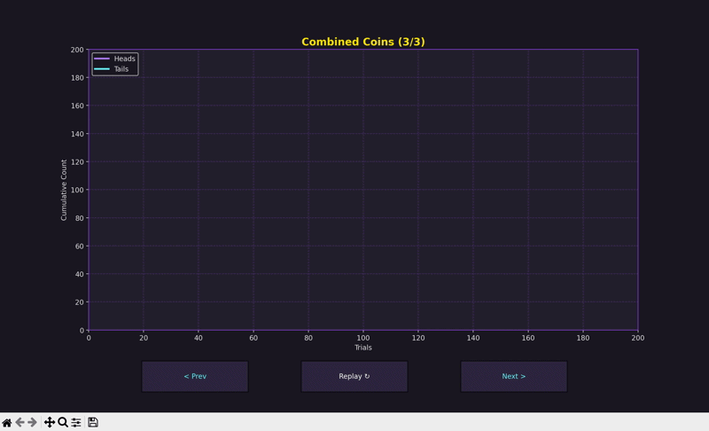<br><sub>Combined Total (Group 6)</sub></td>
  </tr>
</table>

### Step 3: All H&T (Coin Class)

Global results from all 15 groups, separated by coin class. The bottom row is centered for balance.

<table>
  <tr>
    <td>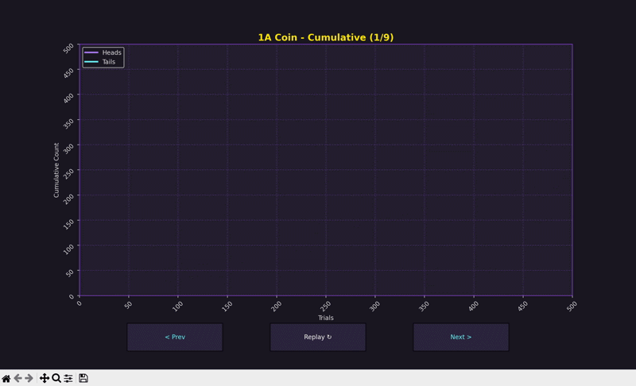<br><sub>1-Peso A (Global)</sub></td>
    <td>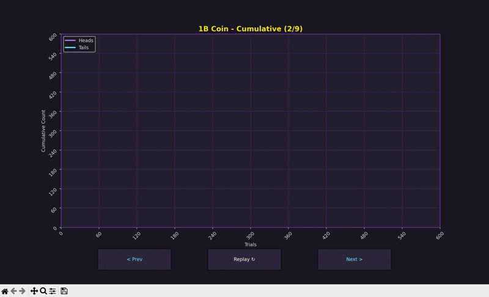<br><sub>1-Peso B (Global)</sub></td>
    <td>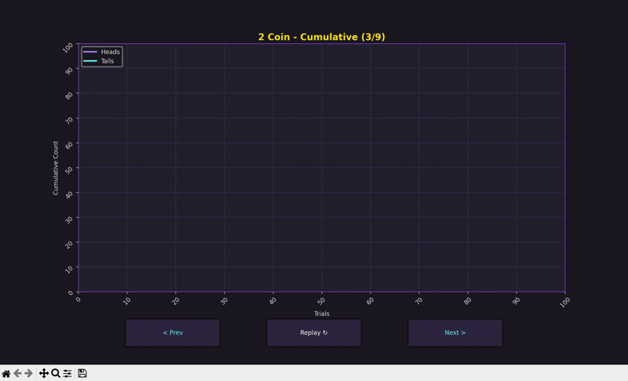<br><sub>2-Peso (Global)</sub></td>
  </tr>
  <tr>
    <td>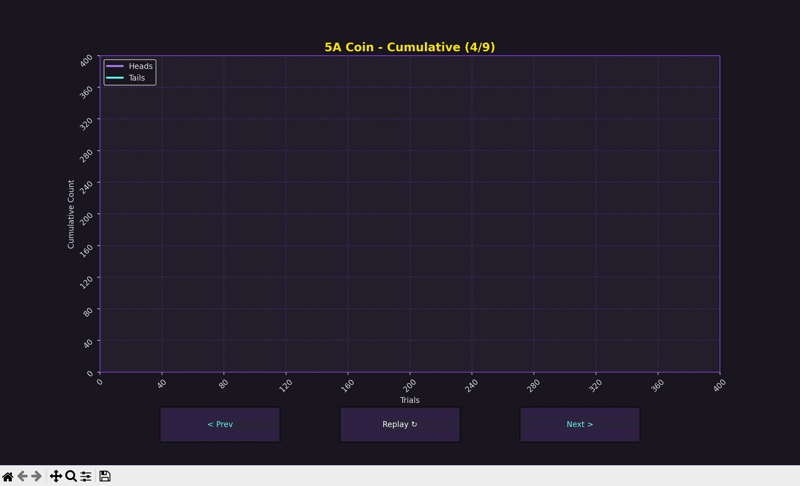<br><sub>5-Peso A (Global)</sub></td>
    <td>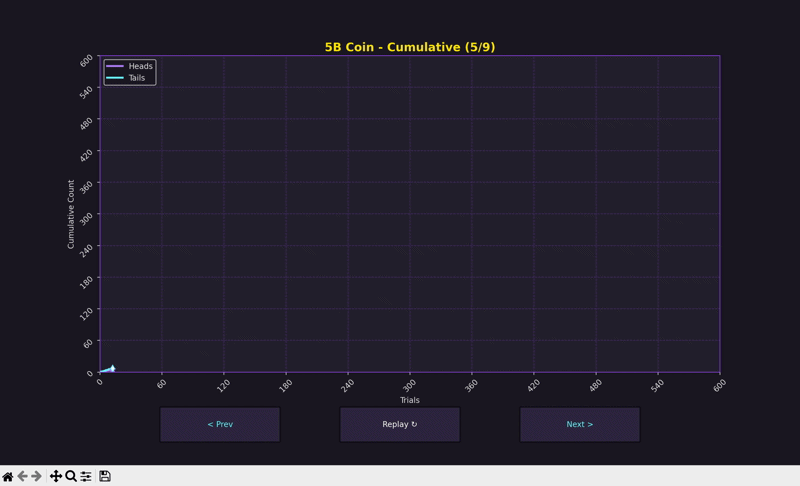<br><sub>5-Peso B (Global)</sub></td>
    <td>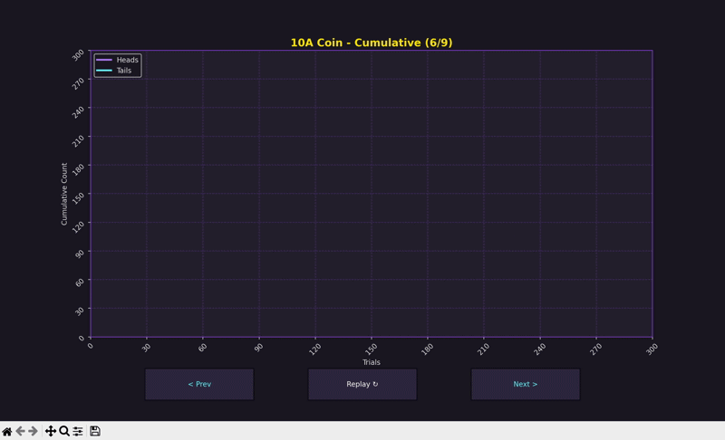<br><sub>10-Peso A (Global)</sub></td>
  </tr>
</table>
<table align="center">
  <tr>
    <td>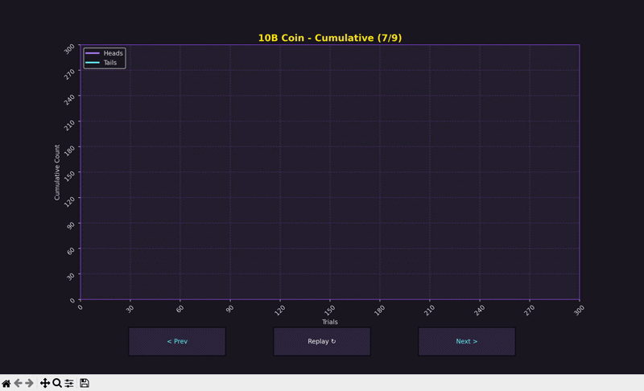<br><sub>10-Peso B (Global)</sub></td>
    <td>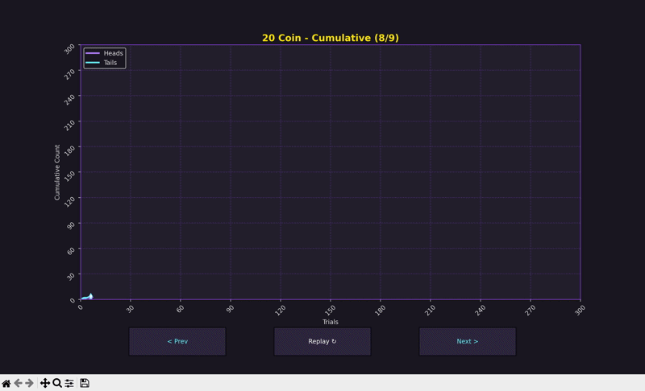<br><sub>20-Peso (Global)</sub></td>
  </tr>
</table>

### Step 4: All H&T (Combined)

The final master convergence plot representing the entire class dataset without separation.

<table align="center">
  <tr>
    <td>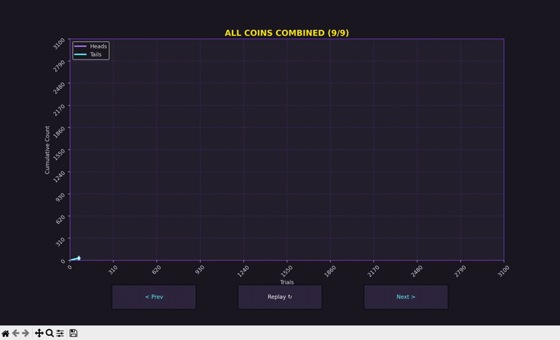<br><sub>Global Master Convergence (All Classes)</sub></td>
  </tr>
</table>

### Step 5: Canvass (Coin Class)

Full comparative analysis of all eight coin classes separated by surface material (Wood vs. Tiles).

#### Wood Surface

<table align="center">
  <tr>
    <td>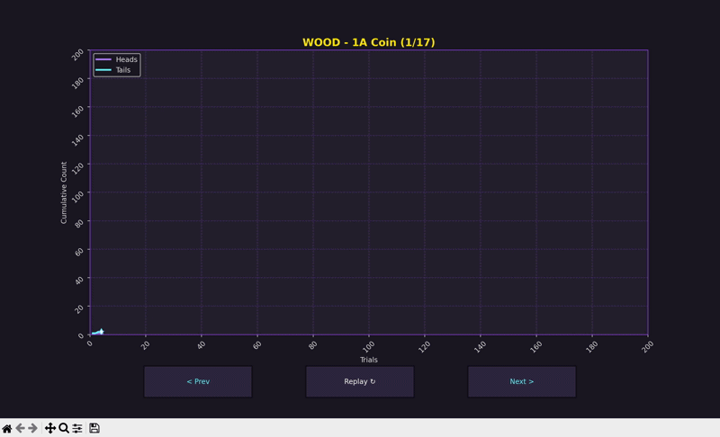<br><sub>1A (Wood)</sub></td>
    <td>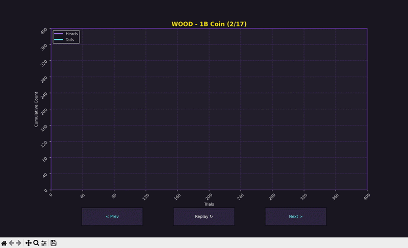<br><sub>1B (Wood)</sub></td>
    <td>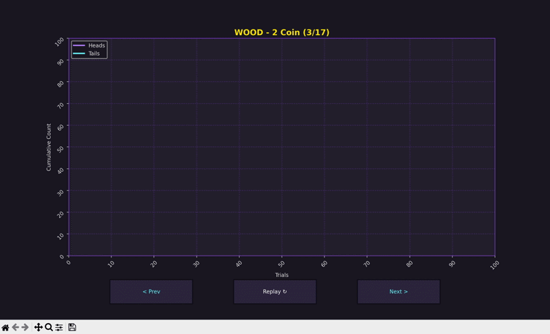<br><sub>2P (Wood)</sub></td>
    <td>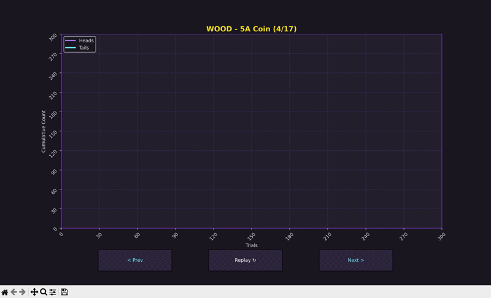<br><sub>5A (Wood)</sub></td>
  </tr>
  <tr>
    <td>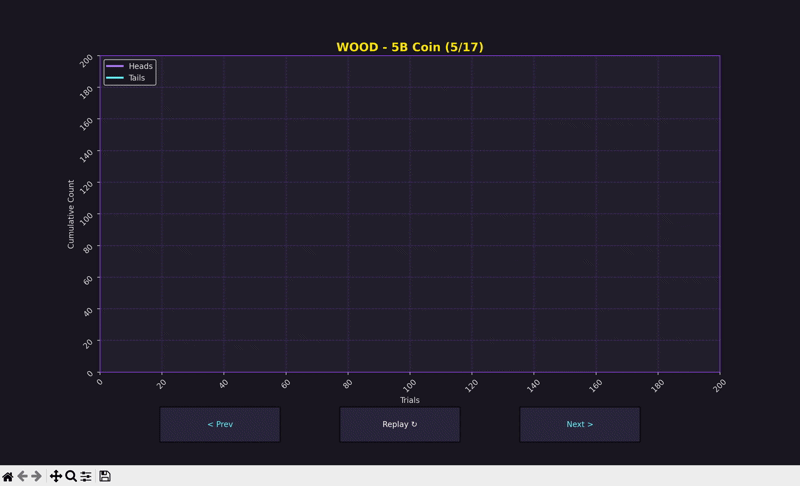<br><sub>5B (Wood)</sub></td>
    <td>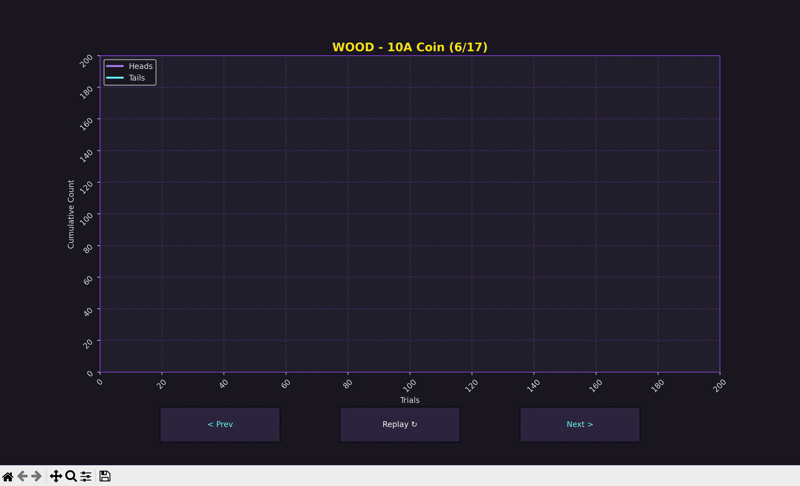<br><sub>10A (Wood)</sub></td>
    <td>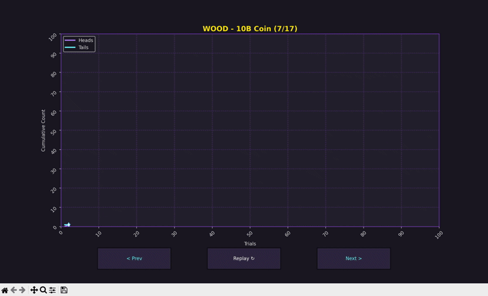<br><sub>10B (Wood)</sub></td>
    <td>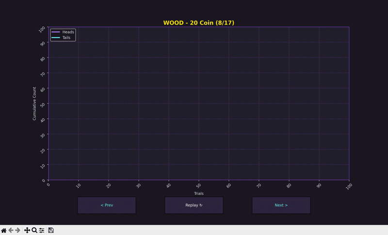<br><sub>20P (Wood)</sub></td>
  </tr>
</table>

#### Tile Surface

<table align="center">
  <tr>
    <td>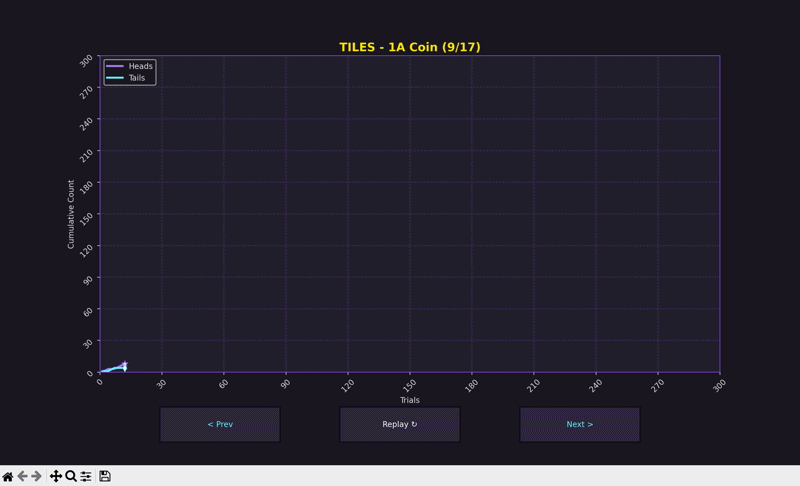<br><sub>1A (Tiles)</sub></td>
    <td>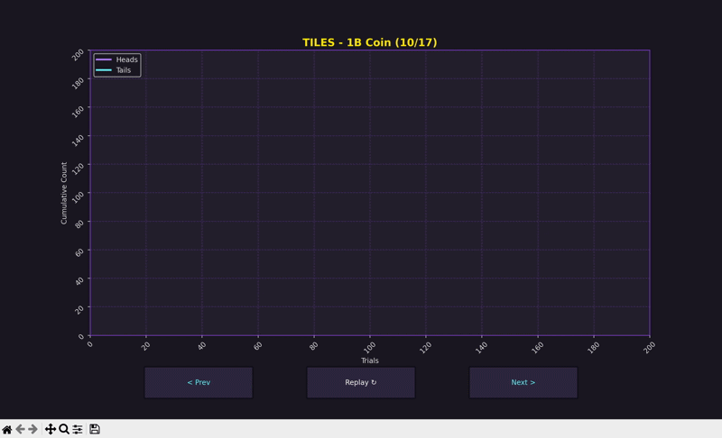<br><sub>1B (Tiles)</sub></td>
    <td>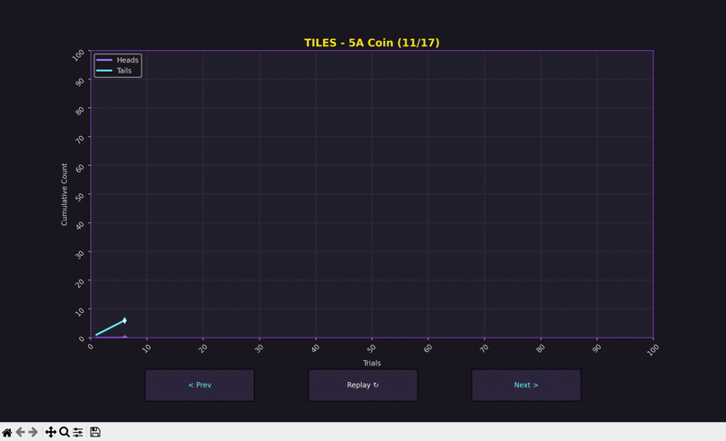<br><sub>5A (Tiles)</sub></td>
    <td>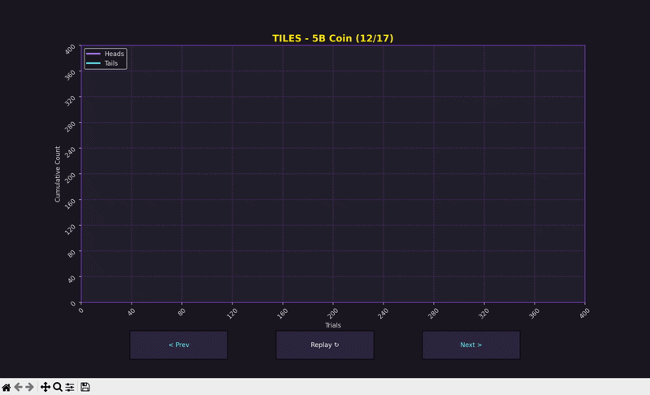<br><sub>5B (Tiles)</sub></td>
  </tr>
</table>
<table align="center">
  <tr>
    <td>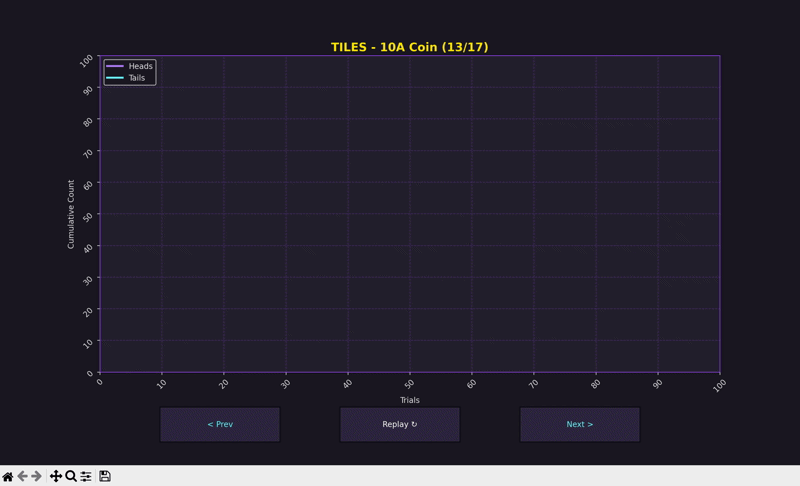<br><sub>10A (Tiles)</sub></td>
    <td><br><sub>10B (Tiles)</sub></td>
    <td>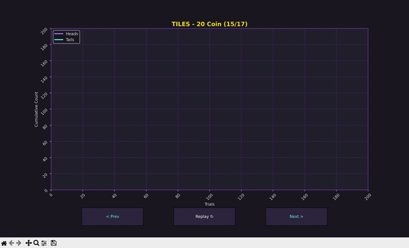<br><sub>20P (Tiles)</sub></td>
  </tr>
</table>

### Step 6: Canvass (Combined)

The overall statistical comparison to determine if surface texture influenced the landing probability across all groups.

<table>
  <tr>
    <td><br><sub>Overall Wood Surface</sub></td>
    <td><br><sub>Overall Tile Surface</sub></td>
  </tr>
</table>

---

## 🚀 Installation and Usage

1. **Install dependencies:**

   ```bash
   pip install matplotlib numpy
   ```

2. **Run the scripts:**

```bash
  python group6.py   # Steps 1 & 2
  python all.py      # Steps 3 & 4
  python canvass.py  # Steps 5 & 6

```

## 🎮 Controls

- **Right Arrow (→):** Next dataset.
- **Left Arrow (←):** Previous dataset.
- **Space Bar:** Replay current animation.

---

## 🏁 Conclusion

Based on the computational analysis of coin flips, the following observations were made:

1. **Law of Large Numbers:** The experiment successfully demonstrated this principle. While individual groups showed minor fluctuations, the cumulative class data consistently converged toward the theoretical mean of **0.5 (50%)**.
2. **Coin Type Bias:** Comparing the various denominations revealed no statistically significant bias. Despite differences in mass and diameter, all coins behaved as fair estimators of probability over large sample sizes.
3. **Surface Influence:** The comparison between **Wood** (high damping) and **Tiles** (high restitution) showed that while surface material affects the physical bounce and duration of a flip, it does not fundamentally alter the outcome probability.

In summary, physical variables such as mass and surface material are negligible factors in the face of long-term statistical convergence. The coin toss remains a robust model for a binomial distribution.
